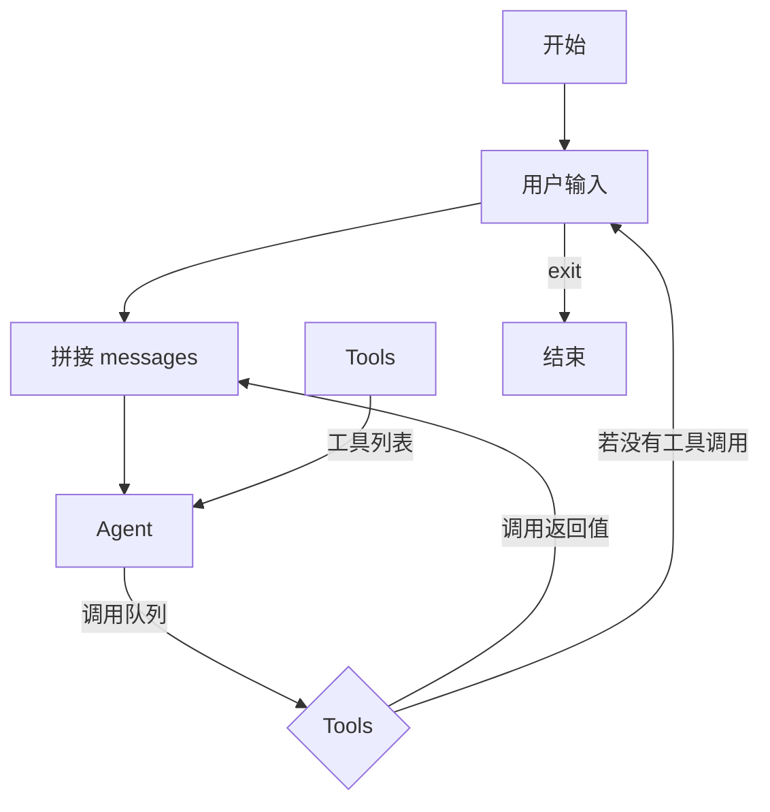

# nanocode 源码解读

## 一、核心流程

## 二、核心构件

从核心流程中可以看出整个流程可以初步分为三个模块：核心流程、Tools 和 Agent

### 2.1、核心 core

负责整个交互循环的控制，以及对用户和系统提示词的拼接。循环流程如核心流程所示。

### 2.2、Tools

负责提供工具列表，以及提供工具调用。nanocode 中一共提供以下几种工具：

read, write, edit, glob, grep, bash

### 2.3、Agent

主要负责和模型提供商联络，收到 messages 后，和 tools 提供的工具列表按一定的格式打包发送给模型提供方，并将返回的值解码成系统需要的格式