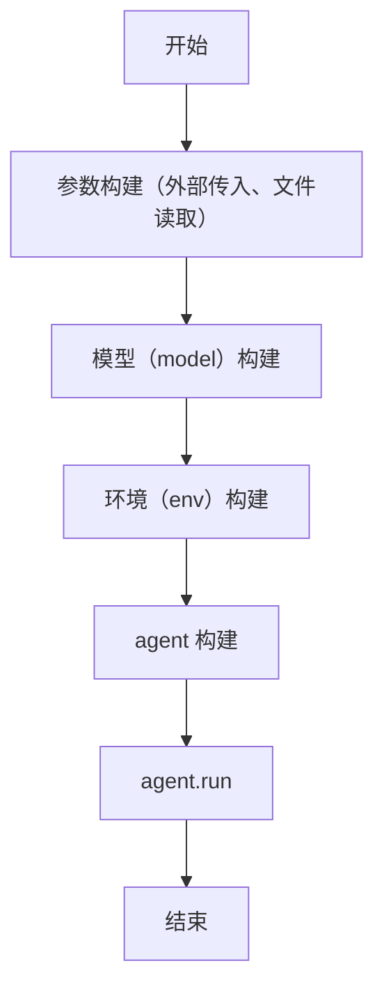

# mini-swe-agent 源码阅读

## 一、核心流程

入口函数位于 `src\minisweagent\run\mini.py` 处，其主要流程为：

## 二、核心模块

### 2.1、模型 Model

位于 `models` 文件夹目录下，如 `models/litellm_model.py` 。为 LLM 接口。负责 `query(messages)` 调模型、把回复解析成消息（含 `extra.actions` 待执行动作）、`format_observation_messages` 把执行结果包回对话，并记录 token/费用。

### 2.2、环境 Environment

位于 `environments` 文件夹下，如 `environments/local.py` 。提供 bash 执行环境。`execute(action)` 把 agent 给出的 bash 命令真正跑起来（本地 shell / Docker 容器），返回 stdout、exit code 等观察结果。

### 2.3、Agent

位于 `agents` 文件夹中。其中 `agents\default.py` 是基类，其似乎默认只有 `agents\interactive.py` 一个子类。下述介绍下 `interactive.py` 中的流程，分为三种：

1、`self.config.mode == "human"` ：每个 step 都不调用 LLM，直接提示用户输入命令，包装成 model 消息返回（`interactive.py:60-71`）——完全由人驱动。

2、`self.config.mode == "confirm"` ：LM 给出命令后、执行前暂停，要求用户确认（`interactive.py:165-182`）：回车=执行；输入文字=拒绝并把评论作为 `UserRejection` 回给 LM；`/u` 切 human；`/y` 切 yolo；白名单正则匹配的命令直接执行（`interactive.py:162`）。

3、`self.config.mode == "yolo"` ：不确认，直接执行。

Agent 与人类交互的时机有以下几种：

- 执行命令前（confirm 模式）：这是最常见的暂停点（`execute_actions` → `_ask_confirmation_or_interrupt`）。

- 触发限额时：`query()` 捕获 `LimitsExceeded` 后询问新的 step/cost limit（`interactive.py:80-94`）；若是非交互终端（CI）则直接干净退出。

- 任务完成时：env 抛 `Submitted` 后，若 `confirm_exit=True`，问用户"回车退出 / 输入新任务 / `/u` 继续"；输入新任务则以 `UserNewTask` 注入继续干活（`interactive.py:144-160`）。`--exit-immediately` 会把 `confirm_exit` 设为 False（`mini.py:81`），完成即退出。

- 用户随时打断：`step()` 捕获 `KeyboardInterrupt`（Ctrl+C），提示输入评论/命令后以 `UserInterruption` 注入（`interactive.py:109-122`）。另外有 `/m` 多行输入、`/h` 帮助、`/y`/`/c`/`/u` 切模式。

任务的完成，由 `mini.yaml` 中的提示词驱动 Agent 在终端中输入特定的命令完成，即 `echo COMPLETE_TASK_AND_SUBMIT_FINAL_OUTPUT` 。在执行环境 env 中若检测到了该字符串且 `returncode == 0` ，则认为该任务执行结束。

### 2.4、一点补充

值得注意的是这个工程中没有 `TOOLS` 模块，`bash` 是唯一的工具，被拆散在 `model` 和 `env` 两侧，不构成独立组件。更具体地：

- 工具定义：在 `model` 层中。只有一个静态 schema `BASH_TOOL`（`models/utils/actions_toolcall.py:11-27`），直接在 `LitellmModel._query` 里硬编码传入 `tools=[BASH_TOOL]`（`litellm_model.py:69`）。
- 动作解析：在 `model` 层中。 `parse_toolcall_actions` 会把 LLM 的 tool_calls 解析成 `{"command": ..., "tool_call_id": ...}`；遇到非 bash 工具名直接报 `FormatError`（`actions_toolcall.py:61`）。textbased 变体则是从纯文本里解析 bash 命令。

- 动作执行：在 `env` 层中。agent 拿到 action 后交给 `env.execute(action)`，环境只是把 `command` 当 shell 命令跑（`local.py:24`），并约定 `echo COMPLETE_TASK_AND_SUBMIT_FINAL_OUTPUT` 表示任务完成（`local.py:45`）。

## 三、一点细节和发现

在 `src\minisweagent\models\utils\cache_control.py` 中发现各家对缓存的控制还不太一样。Anthropic 是显式缓存（必须用 `cache_control` 标记缓存断点，最多 4 个，默认 TTL 5 分钟）；OpenAI 是隐式自动前缀缓存（TTL 几分钟，无需代码）；Gemini 2.5 也有隐式自动缓存（另有可选显式 API）；DeepSeek 同样是自动的。

在 `src\minisweagent\models\utils\anthropic_utils.py` 中发现 Anthropic API 要求 assistant 消息里 thinking block 必须排在其它 block 之前，这里做重排（若只有 thinking 就补一个空 text block）。
