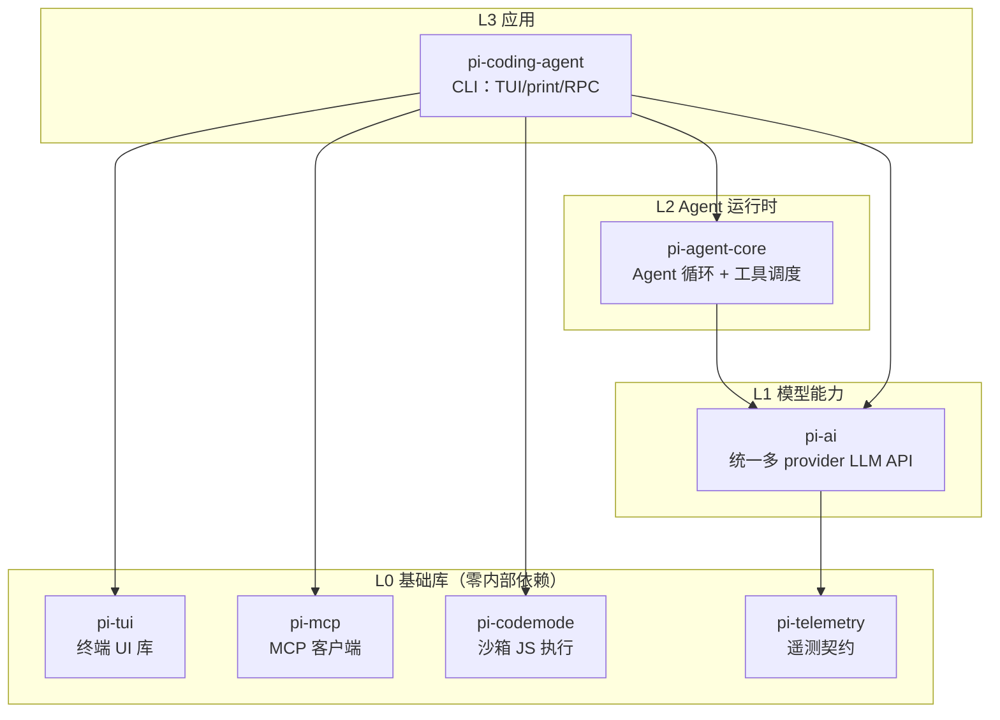
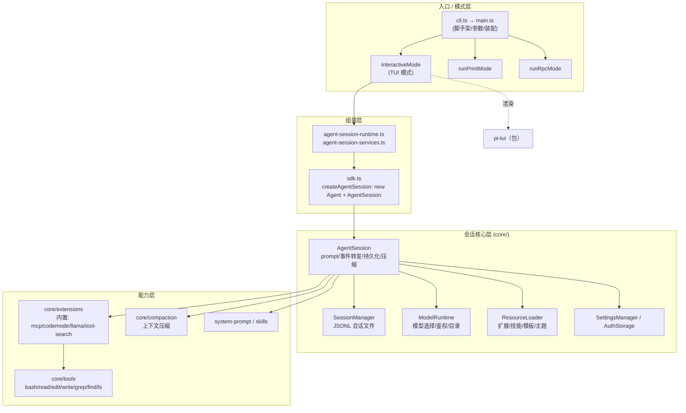
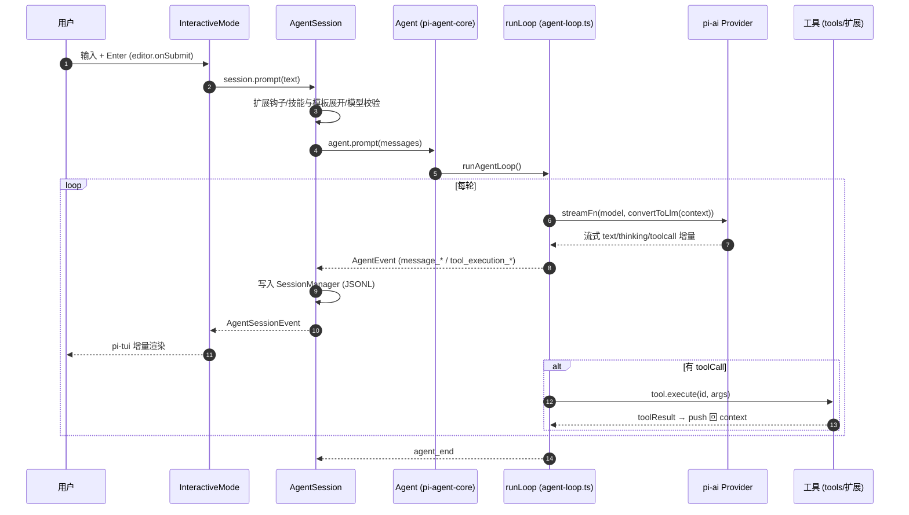
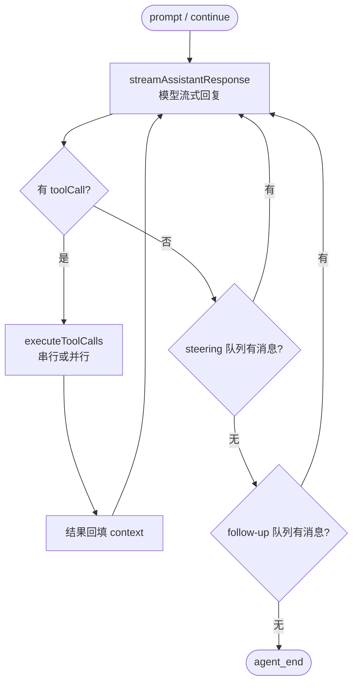
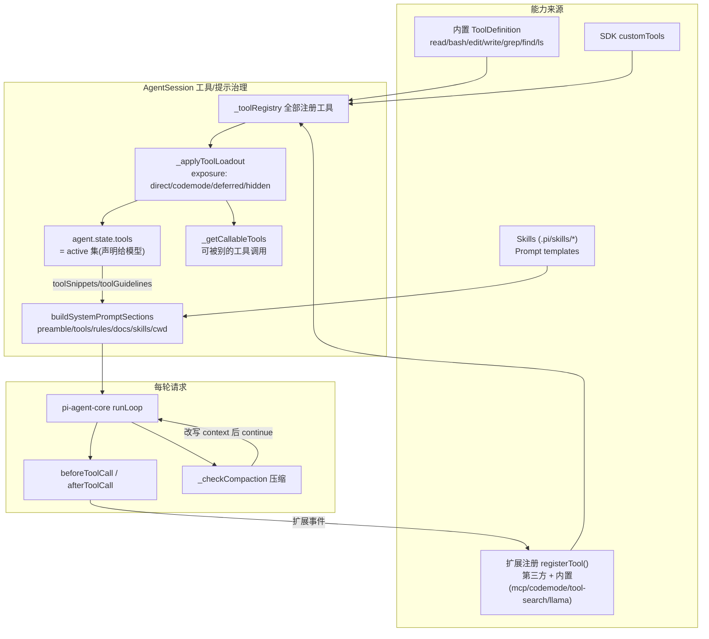

# pi-agent 源码阅读

## 一、核心流程

入口函数位于 `packages/coding-agent/src/cli.ts` 处，其会调用 `main` 函数，`main` 函数的实现位于 `packages/coding-agent/src/main.ts:573` 。

### 1.0、特别注意

`packages` 这个目录下的不少包属于实验性功能。在初次阅读时可以先排除掉实验性功能外用不到的包，以精简阅读，然后再将实验性功能，如分布式的计算系统等功能，加回来再拓展性地阅读。

实验性功能相关的包如下表：

| 包                                        | 不开 experimental | 说明                                             |
| ----------------------------------------- | ----------------- | ------------------------------------------------ |
| `pi-tui`                                  | **必需**          | 交互模式的渲染基础                               |
| `pi-ai`                                   | **必需**          | 模型调用                                         |
| `pi-agent-core`                           | **必需**          | agent 循环                                       |
| `pi-telemetry`                            | **必需**          | `pi-ai` 的依赖                                   |
| `pi-codemode`                             | **必需**          | 内置 `codemode` 扩展（`extensions/index.ts:11`） |
| `pi-mcp`                                  | **必需**          | 内置 `mcp` 扩展（`extensions/index.ts:13`）      |
| `chord`                                   | 可移除*           | 仅 experimental 引用                             |
| `pi-client` / `pi-protocol` / `pi-server` | 可移除            | 仅 experimental + devDeps                        |
| `pi-durable` / `pi-env`                   | 可移除            | 仅 experimental                                  |
| `pi-evals`                                | 可移除            | 纯 dev 工具，不进产品                            |

### 1.1、核心包依赖图

## 1.2、coding-agent 内部模块分层

### 1.3、运行时调用时序（一次 prompt）

### 1.4、Agent 循环状态机（agent-loop.ts:163 内部）

## 二、分层解析

### 2.1、入口/模式层

pi 的运行实际有四种（`--mode` 选择）：interactive、text、json、rpc。其中 `runPrintMode` 一个函数同时承担 text 和 json 两种（print-mode.ts:2-7 的注释）。详细对比见下表：

| interactive | print (text/json) | rpc                   |                       |
| ----------- | ----------------- | --------------------- | --------------------- |
| 生命周期    | 常驻 TUI          | 一次性                | 常驻                  |
| 输入        | 终端键盘          | CLI 参数/管道         | stdin JSON 命令       |
| 输出        | TUI 渲染          | 最终文本 / JSONL 事件 | response + JSONL 事件 |
| 驱动者      | 人                | shell 脚本            | 外部程序              |

选择逻辑在 main.ts:112（`resolveAppMode`）：`--print`/`--mode` 显式指定；否则 stdin/stdout 是 TTY 就进 interactive，任一被重定向就退化为 print。三者共用完全相同的 `AgentSession` 内核，区别只是输入输出适配层。

### 2.2、AgentSession

